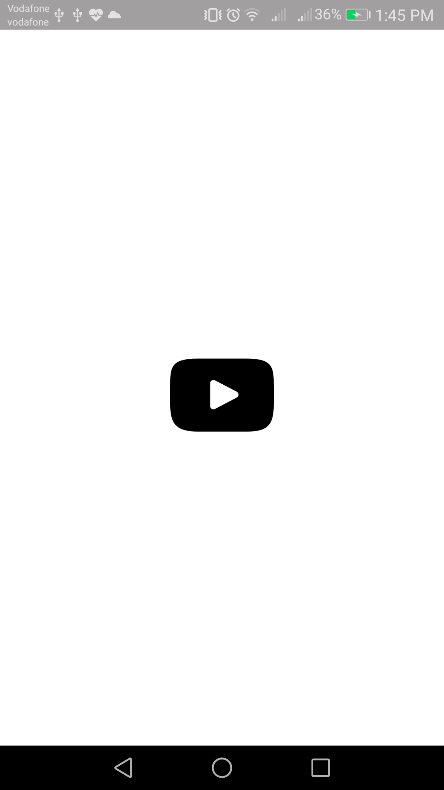

# Youtube Player
A simple Android App for youtube streaming based on Youtube Data API

## Features
1. Displaying a list of trending videos based on a specific region .
2. When clicking on a video it opens and plays in another screen .
3. Displaying Video Statistics {ViewCount, LikesCount, DislikesCount}.

## screenShots 
 

 

## Libraries
* YouTube Android Player API
* Retrofit2
* Gson 
